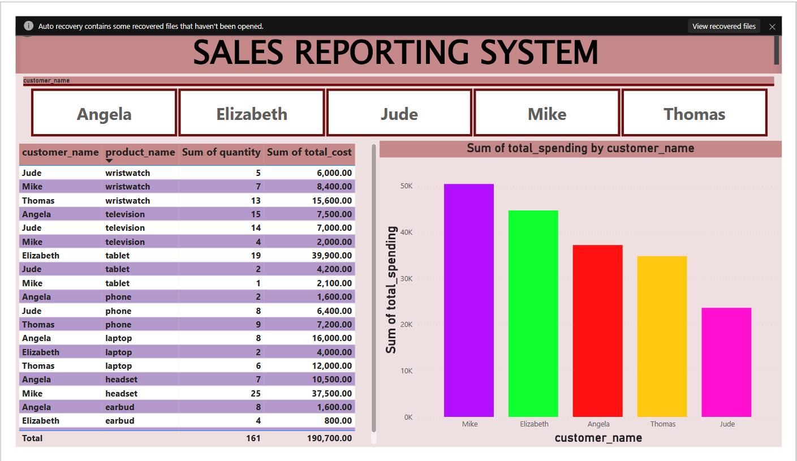
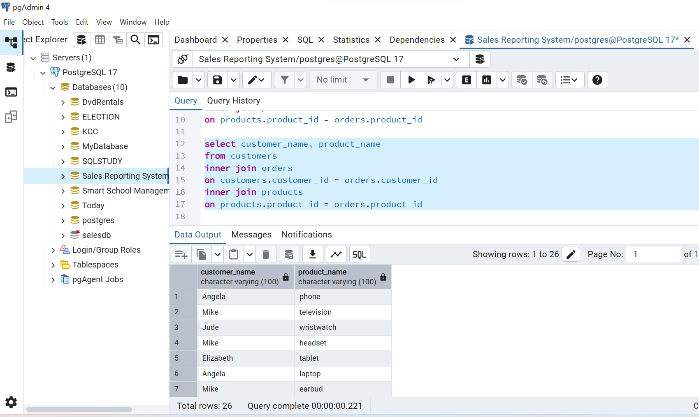
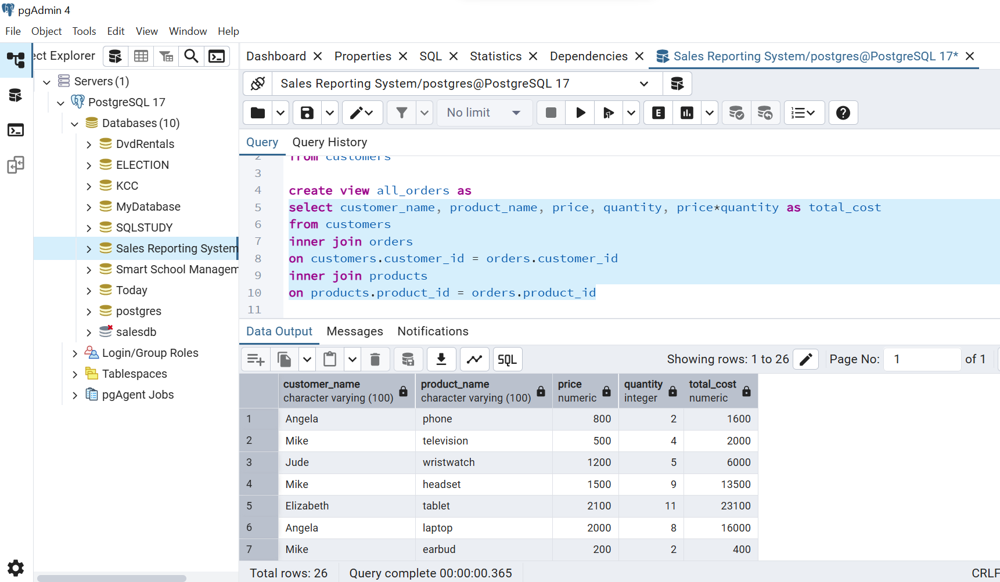
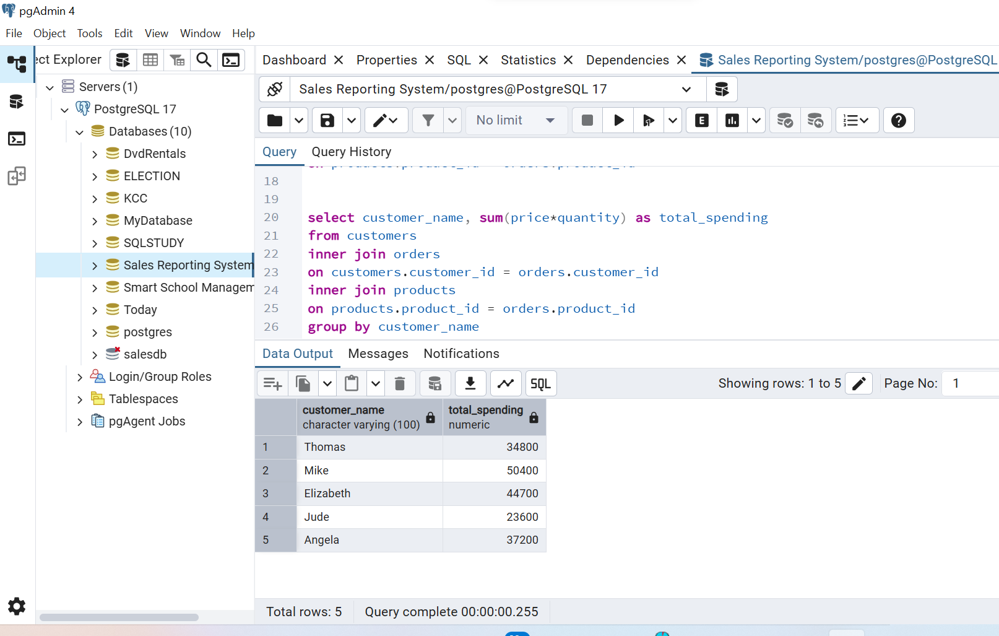

# Sales-Reporting-System
 A data analysis project focused on customers, products, and orders using PostgreSQL for database creation and SQL queries. Visualized insights with Power BI to support sales reporting and business decision-making.
## Problem Statement
 Businesses frequently find it challenging to extract actionable insights from disjointed sales data. This project offers a streamlined system for analyzing customer behavior, product performance, and order trends, facilitating informed decision-making.
## Tools Used
- **PostgreSQL** – For database creation and querying
- **Power BI** – For interactive data visualizations -
- **SQL** – For data extraction, transformation, and aggregation
## Visualization
  
## Skills Demonstrated
(i) ***combining tables to show customer name and products:***
```bash
select customer_name, product_name 
from customers
inner join orders
on customers.customer_id = orders.customer_id
inner join products
on products.product_id = orders.product_id
```


(ii) ***adding quantity and total cost per order:***
```bash
select customer_name, product_name, price, quantity, price*quantity as total_cost
from customers
inner join orders
on customers.customer_id = orders.customer_id
inner join products
on products.product_id = orders.product_id
```


(iii) ***aggregating data showing total spending per customer:***
```bash
select customer_name, sum(price*quantity) as total_spending 
from customers
inner join orders
on customers.customer_id = orders.customer_id
inner join products
on products.product_id = orders.product_id
group by customer_name
```

## Recommendations
- Promote top-selling products more aggressively
-  Improve stock levels for high-demand items
-  Monitor monthly sales dips to adjust strategies
-  Target repeat buyers to increase customer value
## Conclusion
This project illustrates comprehensive data management, covering everything from SQL-based data modeling in PostgreSQL to generating valuable business insights with Power BI. It acts as a fundamental sales analytics solution for any product-driven organization.


